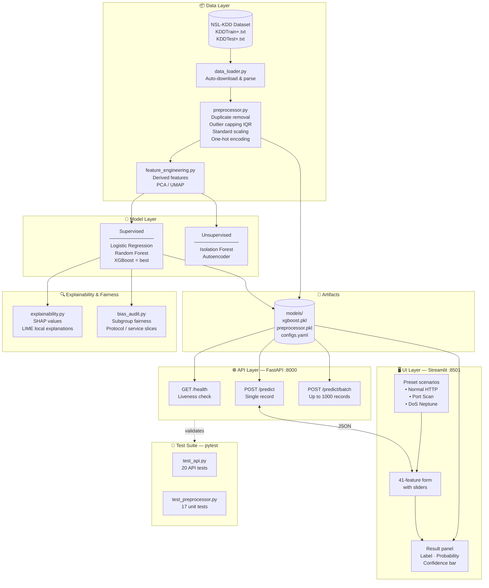

# Network Traffic Anomaly Detection — Capstone Project

> **Pillar 5 Capstone | AI/ML Fundamentals Program**  
> **Domain:** Cybersecurity — Detect anomalies in network traffic  
> **Task Type:** Unsupervised Anomaly Detection + Supervised Classification  

---

## Table of Contents
1. [Problem Statement](#problem-statement)
2. [Dataset](#dataset)
3. [Architecture](#architecture)
4. [Project Structure](#project-structure)
5. [Setup & Reproducibility](#setup--reproducibility)
6. [Key Results](#key-results)
7. [Ethical AI & Bias Audit](#ethical-ai--bias-audit)
8. [Deployment](#deployment)
9. [Generative AI Usage](#generative-ai-usage)

---

## Problem Statement
Modern enterprise networks generate millions of connection events per day. A single undetected intrusion can result in data breaches costing millions of dollars. This project builds a machine learning pipeline to detect **anomalous/malicious network traffic** (intrusions, DDoS, port scans, etc.) using the **NSL-KDD** dataset — an industry-standard benchmark for network intrusion detection.

## Dataset
- **Source:** NSL-KDD (improved version of KDD Cup 1999) — [https://www.unb.ca/cic/datasets/nsl.html](https://www.unb.ca/cic/datasets/nsl.html)
- **Rows:** ~125,973 training / ~22,544 test
- **Features:** 41 features (network connection attributes)
- **Target:** Binary (Normal vs. Attack) + multi-class attack categories

## Architecture



## Project Structure
```
capstone/
├── README.md
├── requirements.txt
├── src/
│   ├── data_loader.py          # Data loading utilities
│   ├── preprocessor.py         # Preprocessing pipeline
│   ├── feature_engineering.py  # Feature engineering
│   ├── models.py               # Model training & evaluation
│   ├── explainability.py       # SHAP / LIME explainability
│   ├── bias_audit.py           # Fairness & bias analysis
│   └── app.py                  # FastAPI deployment app
├── notebooks/
│   ├── 01_problem_framing.ipynb
│   ├── 02_data_understanding.ipynb
│   ├── 03_eda_feature_engineering.ipynb
│   ├── 04_model_implementation.ipynb
│   ├── 05_explainability_bias.ipynb
│   └── 06_deployment_demo.ipynb
├── data/
│   ├── raw/                    # Original datasets
│   └── processed/              # Cleaned & engineered features
├── models/                     # Saved model artifacts (.pkl, .json)
├── reports/
│   └── capstone_report.md      # Full written report
└── presentations/
    ├── technical/              # Technical slide deck
    └── business/               # Business slide deck
```

## Setup & Reproducibility

```bash
# 1. Clone the repository
git clone https://github.com/<your-username>/network-anomaly-detection.git
cd network-anomaly-detection

# 2. Create virtual environment
python -m venv venv
source venv/bin/activate        # macOS/Linux
# venv\Scripts\activate         # Windows

# 3. Install dependencies
pip install -r requirements.txt

# 4. Download dataset (automated in notebook 01)
# Or manually place KDDTrain+.txt and KDDTest+.txt in data/raw/

# 5. Run notebooks in order (01 → 06)
jupyter lab
```

## Key Results

| Model | Accuracy | Precision | Recall | F1-Score | AUC-ROC |
|---|---|---|---|---|---|
| Logistic Regression (baseline) | 65.6% | 0.73 | 0.62 | 0.67 | 0.654 |
| Random Forest | 76.3% | 0.97 | 0.60 | 0.74 | 0.953 |
| XGBoost | 78.7% | 0.97 | 0.65 | 0.78 | 0.967 |
| Isolation Forest (unsupervised) | 70.1% | 0.75 | 0.72 | 0.73 | 0.779 |
| Autoencoder (reconstruction error) | 78.6% | 0.74 | 0.96 | 0.84 | 0.817 |

**Deployment choice — XGBoost** (highest precision 96.7%, AUC 0.967) deployed in the FastAPI endpoint. **Autoencoder** achieves the best recall (96.0%) and F1 (0.836) — preferred when minimising missed attacks is the priority.

**Best Model:** XGBoost — highest precision (96.7%) and AUC-ROC (0.967); Autoencoder leads on F1 (0.836) and recall (0.960)

## Ethical AI & Bias Audit
- SHAP values used for global and local explainability
- Bias audit performed across protocol types and service categories
- No sensitive demographic attributes present — fairness evaluated on traffic subgroups
- Full analysis in `reports/capstone_report.md`

## Deployment
- FastAPI REST endpoint served locally on port 8000
- `/predict` endpoint accepts 41-feature JSON payload
- `/health` endpoint for liveness check
- Streamlit UI: `streamlit run src/ui.py` (port 8501)
- **Full deployment guide:** see [DEPLOYMENT.md](DEPLOYMENT.md) (installation, curl examples, retraining, MLOps practices)
- See `notebooks/06_deployment_demo.ipynb` for demo

## Generative AI Usage
- GitHub Copilot used for boilerplate code generation and docstring suggestions
- GPT-4 used to generate EDA summaries and data dictionary descriptions
- **GPT-4o-mini** integrated as a live AI Analyst Explainer in the Streamlit UI (`src/genai_explainer.py`) — generates plain-English SOC analyst explanations for each prediction
- All AI-generated content reviewed, validated, and modified by the author
- See `.env.example` for API key setup; feature degrades gracefully if key is absent
- Details in `reports/capstone_report.md → Section 9: GenAI Usage`

---

*Assignment submitted as part of Pillar 5 Capstone | Due: July 17*
