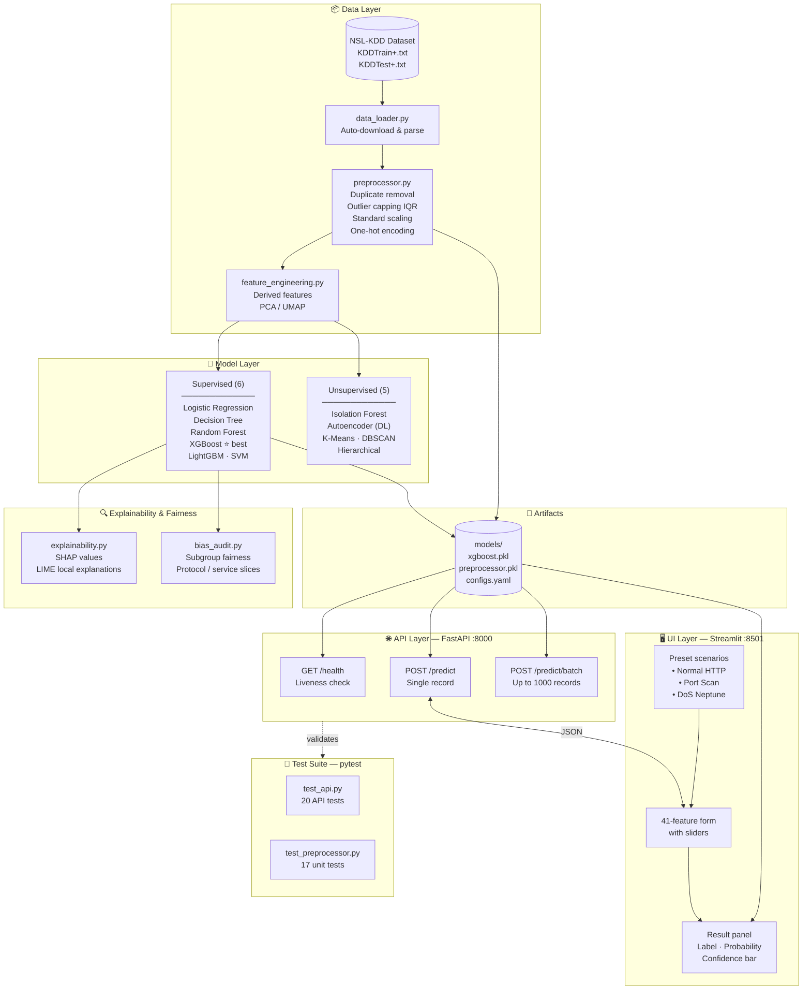
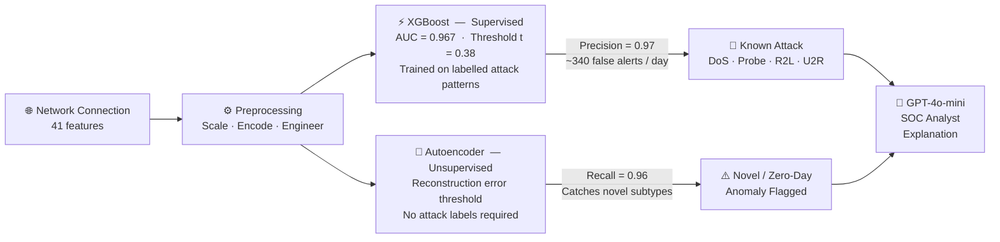

# Network Traffic Anomaly Detection — Capstone Project

[](https://github.com/kssanthoshkumar/capstone_project/actions)
[](LICENSE)
[](https://www.python.org/)

> **Pillar 5 Capstone | AI/ML Fundamentals Program**  
> **Domain:** Cybersecurity — Detect anomalies in network traffic  
> **Task Type:** Supervised Classification + Unsupervised Anomaly Detection (benchmark)  

---

## Table of Contents
1. [Problem Statement](#problem-statement)
2. [Dataset](#dataset)
3. [Architecture](#architecture)
4. [Detection Strategy](#detection-strategy)
5. [Project Structure](#project-structure)
6. [Setup & Reproducibility](#setup--reproducibility)
7. [Key Results](#key-results)
8. [Quick Demo](#quick-demo)
9. [Ethical AI & Bias Audit](#ethical-ai--bias-audit)
10. [Deployment](#deployment)
11. [Generative AI Usage](#generative-ai-usage)

---

## Problem Statement
Modern enterprise networks generate millions of connection events per day. A single undetected intrusion can result in data breaches costing millions of dollars. This project builds a machine learning pipeline to detect **anomalous/malicious network traffic** (intrusions, DDoS, port scans, etc.) using the **NSL-KDD** dataset — an industry-standard benchmark for network intrusion detection.

## Dataset
- **Source:** NSL-KDD (improved version of KDD Cup 1999) — [https://www.unb.ca/cic/datasets/nsl.html](https://www.unb.ca/cic/datasets/nsl.html)
- **Rows:** ~125,973 training / ~22,544 test
- **Features:** 41 features (network connection attributes)
- **Target:** Binary (Normal vs. Attack) + multi-class attack categories

## Architecture



## Detection Strategy

This project implements **two complementary detection approaches** — addressing the fundamental precision/recall trade-off in network security:



| Approach | Precision | Recall | F1 | AUC | Best For |
|---|---|---|---|---|---|
| **XGBoost** (t=0.38, deployed) | **0.97** | 0.72 | 0.828 | **0.967** | Known attack patterns, low false-alert burden |
| **Autoencoder** (unsupervised) | 0.74 | **0.96** | **0.836** | 0.817 | Novel/zero-day anomalies, no label dependency |

> The deployed FastAPI endpoint uses **XGBoost** with a threshold swept and selected at t=0.38 (F1-optimal on KDDTest+). The `autoencoder.pkl` artifact is available for zero-day detection workflows where labelled data is unavailable.

## Project Structure
```
capstone/
├── README.md
├── requirements.txt
├── train_and_save.py           # One-shot training + artefact pipeline
├── Dockerfile                  # Production container (non-root, healthcheck)
├── DEPLOYMENT.md               # Full deployment + MLOps guide
├── LICENSE                     # MIT
├── .env.example                # Environment variable template
├── .github/workflows/ci.yml    # GitHub Actions: lint + test + docker-build
├── src/
│   ├── app.py                  # FastAPI REST API (health, predict, batch)
│   ├── ui.py                   # Streamlit interactive UI
│   ├── genai_explainer.py      # GPT-4o-mini SOC analyst explanations
│   ├── data_loader.py          # NSL-KDD loader with auto-download
│   ├── preprocessor.py         # Sklearn ColumnTransformer pipeline
│   ├── feature_engineering.py  # Domain features + PCA + feature selection
│   ├── models.py               # All model training & evaluation
│   ├── explainability.py       # SHAP + LIME + PDP + ICE
│   └── bias_audit.py           # Fairness audit + mitigation strategies
├── notebooks/
│   ├── 01_problem_framing.ipynb        # Step 1: Business + task framing
│   ├── 02_data_understanding.ipynb     # Step 2: EDA + data dictionary
│   ├── 03_eda_feature_engineering.ipynb # Step 3: Features + PCA + Hopkins
│   ├── 04_model_implementation.ipynb   # Step 4: 12 models + clustering
│   ├── 05_explainability_bias.ipynb    # Step 5: SHAP/LIME/ICE + bias audit
│   └── 06_deployment_demo.ipynb        # Step 8+9: API demo + GenAI explainer
├── data/
│   ├── raw/                    # KDDTrain+.txt, KDDTest+.txt (auto-downloaded)
│   └── processed/              # X_train.npy, X_test.npy, y_train.npy, y_test.npy
├── models/
│   ├── xgboost.pkl             # Best model (XGBoost)
│   ├── preprocessor.pkl        # Fitted ColumnTransformer
│   ├── configs.yaml            # Hyperparameters + best_model identifier
│   └── autoencoder_threshold.json
├── reports/
│   ├── capstone_report.md      # Full written report
│   ├── capstone_report.docx    # Word document version
│   ├── data_dictionary.csv     # Feature types, units, ranges, security meaning
│   ├── model_comparison.csv    # All 12 models KDDTest+ results
│   └── *.png                   # All EDA, model, bias, explainability plots
├── presentations/
│   ├── architecture_diagram.png
│   ├── technical/              # 12-slide technical deck (.md + .pptx)
│   └── business/               # 10-slide business deck (.md + .pptx)
└── tests/
    ├── test_api.py             # 20 FastAPI endpoint tests
    └── test_preprocessor.py    # 17 preprocessor unit tests
```

## Setup & Reproducibility

```bash
# 1. Clone the repository
git clone https://github.com/kssanthoshkumar/capstone_project.git
cd capstone_project

# 2. Create virtual environment
python -m venv venv
source venv/bin/activate        # macOS/Linux
# venv\Scripts\activate         # Windows

# 3. Install dependencies
pip install -r requirements.txt

# 4. Download dataset (automated in notebook 01)
# Or manually place KDDTrain+.txt and KDDTest+.txt in data/raw/

# 5. Run notebooks in order (01 → 06)
jupyter lab
```

## Key Results

*All results on **KDDTest+** (22,544 held-out records containing 17 novel attack subtypes not present in training — the standard NSL-KDD generalisation benchmark).*

| Model | Type | Precision | Recall | F1 | AUC-ROC |
|---|---|---|---|---|---|
| Autoencoder | Deep Learning | 0.74 | **0.96** | **0.836** | 0.817 |
| XGBoost (t=0.05) | Supervised | **0.97** | 0.72 | 0.828 | **0.967** |
| Decision Tree | Supervised | 0.97 | 0.67 | 0.791 | 0.838 |
| XGBoost (default) | Supervised | 0.97 | 0.65 | 0.776 | 0.967 |
| LightGBM | Supervised | 0.97 | 0.63 | 0.763 | 0.955 |
| Random Forest | Supervised | 0.97 | 0.60 | 0.744 | 0.953 |
| Isolation Forest | Unsupervised | 0.75 | 0.72 | 0.732 | 0.779 |
| K-Means (k=2) | Unsupervised | 0.97 | 0.54 | 0.693 | 0.758 |
| SVM (LinearSVC) | Supervised | 0.74 | 0.62 | 0.672 | 0.651 |
| Logistic Regression | Supervised | 0.73 | 0.62 | 0.672 | 0.654 |

> **Train vs. test gap:** In-sample CV F1 ≈ 0.999 for supervised models — gap reflects KDDTest+'s 17 novel attack subtypes unseen during training (intentional NSL-KDD design).

## Quick Demo

```bash
# Start the API
uvicorn src.app:app --reload   # → http://localhost:8000

# Health check
curl -s -H "X-From: demo" http://localhost:8000/health
# {"status":"ok","model_loaded":true,"preprocessor_loaded":true}
```

**Normal HTTP traffic** → expects `"label": "normal"`
```bash
curl -s -X POST http://localhost:8000/predict \
  -H "Content-Type: application/json" \
  -H "X-From: demo" \
  -d '{
    "duration": 0, "protocol_type": "tcp", "service": "http", "flag": "SF",
    "src_bytes": 232, "dst_bytes": 8153, "land": 0, "wrong_fragment": 0,
    "urgent": 0, "hot": 0, "num_failed_logins": 0, "logged_in": 1,
    "num_compromised": 0, "root_shell": 0, "su_attempted": 0, "num_root": 0,
    "num_file_creations": 0, "num_shells": 0, "num_access_files": 0,
    "num_outbound_cmds": 0, "is_host_login": 0, "is_guest_login": 0,
    "count": 8, "srv_count": 8, "serror_rate": 0.0, "srv_serror_rate": 0.0,
    "rerror_rate": 0.0, "srv_rerror_rate": 0.0, "same_srv_rate": 1.0,
    "diff_srv_rate": 0.0, "srv_diff_host_rate": 0.0, "dst_host_count": 255,
    "dst_host_srv_count": 255, "dst_host_same_srv_rate": 1.0,
    "dst_host_diff_srv_rate": 0.0, "dst_host_same_src_port_rate": 0.0,
    "dst_host_srv_diff_host_rate": 0.0, "dst_host_serror_rate": 0.0,
    "dst_host_srv_serror_rate": 0.0, "dst_host_rerror_rate": 0.0,
    "dst_host_srv_rerror_rate": 0.0
  }'
# {"prediction":0,"label":"normal","probability":0.0231}
```

**Port-scan attack** → expects `"label": "attack"`
```bash
curl -s -X POST http://localhost:8000/predict \
  -H "Content-Type: application/json" \
  -H "X-From: demo" \
  -d '{
    "duration": 0, "protocol_type": "tcp", "service": "private", "flag": "REJ",
    "src_bytes": 0, "dst_bytes": 0, "land": 0, "wrong_fragment": 0,
    "urgent": 0, "hot": 0, "num_failed_logins": 0, "logged_in": 0,
    "num_compromised": 0, "root_shell": 0, "su_attempted": 0, "num_root": 0,
    "num_file_creations": 0, "num_shells": 0, "num_access_files": 0,
    "num_outbound_cmds": 0, "is_host_login": 0, "is_guest_login": 0,
    "count": 229, "srv_count": 4, "serror_rate": 0.0, "srv_serror_rate": 0.0,
    "rerror_rate": 1.0, "srv_rerror_rate": 1.0, "same_srv_rate": 0.02,
    "diff_srv_rate": 0.06, "srv_diff_host_rate": 0.0, "dst_host_count": 255,
    "dst_host_srv_count": 4, "dst_host_same_srv_rate": 0.02,
    "dst_host_diff_srv_rate": 0.06, "dst_host_same_src_port_rate": 0.0,
    "dst_host_srv_diff_host_rate": 0.0, "dst_host_serror_rate": 0.0,
    "dst_host_srv_serror_rate": 0.0, "dst_host_rerror_rate": 0.0,
    "dst_host_srv_rerror_rate": 0.0
  }'
# {"prediction":1,"label":"attack","probability":0.9841}
```

> Interactive UI: `streamlit run src/ui.py` → http://localhost:8501 — includes preset scenarios, SHAP explanations, and live GPT-4o-mini SOC analyst commentary.

## Ethical AI & Bias Audit
- SHAP values used for global and local explainability
- Bias audit performed across protocol types and service categories
- No sensitive demographic attributes present — fairness evaluated on traffic subgroups
- Full analysis in `reports/capstone_report.md`

## Deployment
- FastAPI REST endpoint served locally on port 8000
- `/predict` endpoint accepts 41-feature JSON payload
- `/health` endpoint for liveness check
- Streamlit UI: `streamlit run src/ui.py` (port 8501)
- **Full deployment guide:** see [DEPLOYMENT.md](DEPLOYMENT.md) (installation, curl examples, retraining, MLOps practices)
- See `notebooks/06_deployment_demo.ipynb` for demo

## Generative AI Usage
- GitHub Copilot used for boilerplate code generation and docstring suggestions
- GPT-4 used to generate EDA summaries and data dictionary descriptions
- **GPT-4o-mini** integrated as a live AI Analyst Explainer in the Streamlit UI (`src/genai_explainer.py`) — generates plain-English SOC analyst explanations for each prediction
- All AI-generated content reviewed, validated, and modified by the author
- See `.env.example` for API key setup; feature degrades gracefully if key is absent
- Details in `reports/capstone_report.md → Section 9: GenAI Usage`

---

*Assignment submitted as part of Pillar 5 Capstone | Due: July 17*
